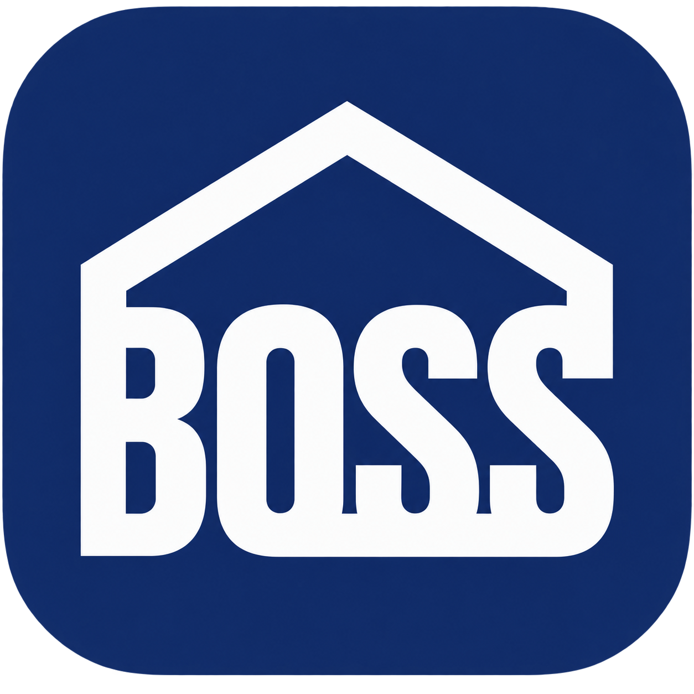

#  **BOSS AI**

<p align="left">
  <a href="aiagent/README.md"></a>
  <a href="ai_vision/Vision.md"></a>
  <a href="report_agent/README.md"></a>
  <a href="videoagent/README.md"></a>
</p>

> BOSS의 AI 기능 저장소입니다. 
> AI 비서, CCTV 위험 감지, 조치 사진 검증, 안전 보고서, 교육 영상 생성을 각각 독립 서비스로 제공합니다.

| 바로가기 | 담당 기능 | README |
| --- | --- | --- |
| **AI Agent** | 안전 관리·교육·법령 질의 응답 | [바로가기](aiagent/README.md) |
| **AI Vision** | CCTV 위험 감지 및 AI 사진 검증 | [바로가기](ai_vision/Vision.md) |
| **Report Agent** | 안전 관리 문서 생성 | [바로가기](report_agent/README.md) |
| **VideoAgent** | 교육 영상 비동기 생성 | [바로가기](videoagent/README.md) |

## 🛠️ **기술 스택**

<p>
  
  
  
  
</p>
<p>
  
  
  
  
</p>
<p>
  
  
  
  
</p>

| 영역 | 사용 기술 | 적용 서비스 |
| --- | --- | --- |
| API·검증 | Python, FastAPI, Uvicorn, Pydantic | 전체 AI API |
| LLM·Agent | OpenAI, LangGraph, LangChain | AI Agent, AI Verify, Report Agent |
| Vision | Ultralytics YOLO, OpenCV, PyTorch/CUDA 실행 환경 | AI Vision |
| 비동기 작업 | Celery, Redis | VideoAgent |
| 미디어·클라우드 | AWS S3, CloudFront 연동, Google Cloud/Veo | AI Vision, VideoAgent |

## 🔎 **AI 서비스 구성**

```text
Frontend / Backend
  ├─ AI Agent :8001
  │   └─ 안전 관리·교육·법령 질의 응답
  ├─ AI Vision :8002
  │   ├─ CCTV 분석 스트림·장비 상태·실시간 감지 이벤트
  │   └─ 감지 스냅샷 저장 → Backend /api/ai/events 전송
  ├─ AI Verify :8003
  │   └─ 조치 전·후 사진 비교 및 검증 결과 제공
  ├─ Report Agent :8004
  │   └─ Backend 안전 데이터를 기반으로 문서 생성
  └─ VideoAgent :8100
      └─ Redis·Celery 기반 교육 영상 비동기 생성
```

| 서비스 | 역할 | 로컬 기본 포트 |
| --- | --- | ---: |
| `aiagent` | 자연어 안전 관리 챗봇 API | 8001 |
| `ai_vision/ai_server.py` | CCTV 객체·위험 감지, 스트림, 이벤트 전송 | 8002 |
| `ai_vision/ai_verify.py` | 조치 전/후 사진 AI 검증 | 8003 |
| `report_agent` | 안전 보고서 생성 API | 8004 |
| `videoagent` | 교육 영상 생성 API 및 Celery worker | 8100 |

AI 서비스는 분석·생성·검증을 담당하고, 사용자 인증과 업무 데이터의 영속화는 Backend가 담당합니다. Vision의 감지 이벤트와 S3 스냅샷은 Backend API를 통해 이후 점검·조치 이력으로 연결됩니다.

## 📁 **디렉터리 구조**

```text
AI/
├─ .github/workflows/      # GitHub Actions 배포 자동화
├─ aiagent/                # 안전 관리·교육·법령 질의 AI Agent
├─ ai_vision/              # CCTV Vision·사진 검증·모델 및 평가 산출물
├─ report_agent/           # 안전 관리 문서 생성 Agent
├─ videoagent/             # 교육 영상 API·Celery worker
├─ public/                 # README 파비콘 등 공용 정적 자산
└─ README.md               # AI 서비스 통합 안내
```

## 💡 **AI 주요 기능**

| 번호 | 기능 | 설명 |
| --- | --- | --- |
| 1 | [AI Agent](#ai-agent) | 안전 관리·교육·법령 질의 응답 |
| 2 | [CCTV Vision](#cctv-vision) | CCTV 위험 감지와 이벤트 전송 |
| 3 | [AI Verify](#action-photo-verify) | 조치 전후 사진 검증 |
| 4 | [Report Agent](#report-agent) | 안전 관리 문서 생성 |
| 5 | [VideoAgent](#videoagent) | 교육 영상 비동기 생성 |

<a id="ai-agent"></a>

## 💻 **1. AI Agent** — `aiagent`

### **1-1. 개요**

안전·조치 이력, 교육 현황, 산업안전 법령 정보를 기반으로 질문에 답하는 챗봇 API입니다. JWT로 사용자와 회사를 확인한 뒤, 질문의 의도를 분석하여 조치 관리·교육 관리·법령 정보 영역으로 분류하고 관련 데이터를 조회해 답변을 생성합니다.

### **1-2. API 및 특징**

- `POST /api/agent/query`
- `GET /health`
- 대화 ID를 기준으로 최근 문맥을 유지하여 후속 질문을 처리합니다.
- 안전 관리 데이터는 backend 및 읽기 전용 AI DB에서 조회하고, 법령 관련 질의는 국가법령정보 Open API를 활용합니다.
- 조회 결과에 없는 수치나 상태를 임의로 만들지 않고, 사용자 권한과 회사 범위 안의 데이터에 기반해 응답하는 것을 원칙으로 합니다.

### **1-3. 처리 흐름**

```text
사용자 질문 → JWT/회사 범위 확인 → 대화 문맥 조회 → Router Agent
           → 조치·교육·법령 전문 Agent → 근거 데이터 조회 → 답변 생성
```

조치 관리 영역에서는 위험 이벤트, 조치 진행 상태, 승인·반려 현황, 관련 조치 이력을 확인합니다. 교육 관리 영역에서는 교육 과정, 대상자, 이수·미이수 현황, 과정별 진행 정보를 다룹니다. 법령 정보 영역에서는 관련 조문을 조회하고 출처와 함께 안내합니다. 서비스는 업무 데이터를 직접 수정하지 않는 조회·응답 계층으로 동작합니다.

---

<a id="cctv-vision"></a>

## 📹 **2. CCTV Vision** — `ai_vision/ai_server.py`

### **2-1. 개요**

YOLO 기반 모델을 산업안전 영상 데이터로 파인튜닝하여 CCTV 영상과 장비 점검 영상을 분석합니다. 화재·연기, 지게차-작업자 근접 위험, 소화장비 상태를 감지하고 MJPEG 스트림과 분석 프레임을 제공합니다. 감지 시 스냅샷을 S3에 저장하고 backend의 `POST /api/ai/events`로 이벤트를 전송합니다.

### **2-2. API 및 특징**

- `GET /health`, `GET /streams/{camera_id}`, `GET /frames/{camera_id}`
- `GET /equipment/status`, `GET /events`, `POST /reset`
- 동적 CCTV(화재·지게차)는 클라이언트가 스트림을 요청하면 worker thread가 분석을 시작합니다. 같은 위험을 반복 등록하지 않도록 연속 감지와 세션별 발행 제어를 적용합니다.
- 정적 장비(소화기·소화전)는 별도 스케줄러가 설정된 간격으로 점검하며, 기본 주기는 10분입니다.
- 화재·연기, 지게차-작업자 근접 위험, 소방 설비 상태를 분석합니다.
- 실시간 CCTV 스트림과 분석된 최신 프레임을 제공합니다.
- 위험 감지 시 스냅샷을 저장하고, backend에 이벤트를 등록합니다.
- 등록된 이벤트는 모니터링·조치 이력·조치 전후 사진 검증 흐름으로 연결됩니다.

### **2-3. 화재·연기 모델 학습 및 개선 방향**

화재·연기 감지 모델은 기존 화재·연기 객체 탐지 모델을 기반으로, Roboflow에서 수집·관리한 데이터셋을 통합하여 추가 파인튜닝한 모델입니다. 목적은 단순한 Fire/Smoke 탐지 데이터의 확대뿐 아니라, 실제 물류창고 CCTV 환경에서 발생하던 False Positive를 줄이는 것이었습니다.

학습 데이터는 다음 방향으로 구성했습니다.

- 기존 Fire/Smoke 데이터에 추가 화재·연기 이미지를 보강하여 탐지 성능을 높였습니다.
- 실제 물류창고 환경의 선반, 박스, 벽, 시설물 이미지를 negative 데이터로 추가했습니다. 화재나 연기가 없는 창고 장면에서는 아무것도 탐지하지 않도록 학습하기 위한 구성입니다.
- 기존 모델이 화재로 잘못 판단하기 쉬웠던 소화기, 소화전·소화전함 이미지를 Fire/Smoke 라벨 없이 negative 데이터로 추가했습니다.

이는 실제 서비스에서 자주 발생한 오탐 대상에 집중한 **Hard Negative 학습** 방식입니다. 즉, 소화기·소화전·빨간색 시설물처럼 화재와 시각적으로 혼동될 수 있는 물체가 보이더라도 화재로 탐지하지 않도록 모델을 보완했습니다. 결과적으로 이번 파인튜닝은 화재·연기 탐지 성능을 보강하는 동시에, 물류창고 CCTV 환경에 맞춘 오탐 감소를 목표로 합니다.

학습용 데이터셋과 평가 산출물은 `ai_vision/evaluation_dataset` 및 `ai_vision/runs/detect/evaluation_result`에 보관되어 있습니다. 운영 서비스가 참조하는 가중치 변경은 별도의 성능 검증과 `CameraConfig` 설정 변경을 통해서만 반영합니다.

### **2-4. Vision 처리 흐름**

1. 서비스 시작 시 추론 모델을 로드하고 워밍업합니다.
2. 동적 CCTV 스트림은 프레임을 분석하여 화재·연기 또는 지게차-작업자 근접 위험을 판단합니다.
3. 정적 장비 점검은 별도 검사 흐름에서 소화기·소화전 등 안전 설비 상태를 분석합니다.
4. 위험이 확정되면 분석 프레임을 스냅샷으로 저장하고, CCTV ID·카테고리 ID·이미지 경로를 포함한 이벤트를 backend로 전송합니다.
5. frontend는 Vision API에서 실시간 스트림·프레임·상태를 조회하고, backend가 관리하는 이벤트 및 조치 이력에서 저장된 스냅샷을 표시합니다.

이 구조로 실시간 모니터링 화면과 업무 이력이 분리됩니다. 영상 분석 자체는 Vision 서비스가 담당하지만, 이벤트·조치·검증 결과의 영속화와 사용자 권한 관리는 backend가 담당합니다. 따라서 감지 결과는 단순 알림으로 끝나지 않고 조치 이력과 후속 검증으로 이어질 수 있습니다.

---

<a id="action-photo-verify"></a>

## 🖼️ **3. AI Verify** — `ai_vision/ai_verify.py`

### **3-1. 개요**

조치 전·후 사진을 OpenAI로 비교하여 조치 수행 여부를 판단하는 서비스입니다. 조치 내용과 이미지 쌍을 함께 분석하여 실제로 위험 요인이 개선되었는지 판별하고, 검증 여부·신뢰도·요약을 반환합니다.

### **3-2. API 및 특징**

- `POST /api/ai/verify-action`
- backend가 이 API를 호출하고, 응답을 조치 이력의 AI 검증 결과로 저장합니다.
- 사진 저장 및 URL 생성은 backend/미디어 저장소의 책임이며, AI Verify는 S3 업로드를 하지 않습니다.
- API 오류 또는 모델 판단 불확실성은 자동 승인으로 처리하지 않고 backend의 업무 흐름에서 재검토할 수 있어야 합니다.

AI Verify는 CCTV 감지 이후의 **조치 완료 확인** 단계에 사용됩니다. 사용자가 현장 조치 후 사진을 등록하면 backend가 조치 전 이미지·조치 후 이미지·조치 설명을 준비해 검증 API에 전달하고, 반환된 분석 결과를 조치 이력에 연결합니다. 이를 통해 단순 사진 첨부가 아니라 위험 요소가 실제로 개선되었는지 확인하는 보조 근거를 제공합니다.

---

<a id="report-agent"></a>

## 📄 **4. Report Agent** — `report_agent`

### **4-1. 개요**

backend의 안전·점검·조치 데이터를 수집·정리하여 위험성 평가서, 관리 검토 보고서, 근로자 의견서 등을 생성합니다. 보고서별 요청 API가 분리되어 있어 필요한 문서 유형을 선택해 생성할 수 있습니다.

### **4-2. API 및 특징**

- `GET /health`
- `/api/report/...`
- Swagger: `/docs`
- 보고서 생성 전에 backend 데이터를 조회하므로, 보고서의 근거는 시스템에 등록된 점검·조치·위험 정보에서 가져옵니다.
- OpenAI 모델은 수집된 근거를 문서 형식으로 정리하는 역할을 하며, 원본 안전 데이터의 저장·수정은 backend가 담당합니다.

보고서 서비스는 데이터 원천과 문서 생성 책임을 분리합니다. backend에 축적된 사고·점검·조치·위험성 정보를 필요한 양식에 맞게 정리하고, 생성 요청별로 위험성 평가, 관리 검토, 작업자 의견 반영 문서 등 서로 다른 산출물을 제공합니다. 생성된 문서는 사용자가 검토할 수 있는 초안 성격이며, 기준 데이터의 최신성은 backend 데이터에 의해 결정됩니다.

---

<a id="videoagent"></a>

## 🎬 **5. VideoAgent** — `videoagent`

### **5-1. 개요**

교육 문서(PDF/PPTX/TXT) 또는 텍스트에서 학습 목표와 스토리보드를 만들고, Veo 기반 교육 영상을 생성합니다. API는 요청을 접수하고 Celery worker가 실제 생성 파이프라인을 처리합니다. 생성 결과는 S3에 저장되고 `MEDIA_BASE_URL`을 통해 재생 URL을 구성합니다.

### **5-2. API 및 특징**

- `POST /video/generate`
- `GET /video/generate/{task_id}/status`
- `GET /health`
- Redis, API, Celery worker가 모두 필요합니다.
- 문서 분석 → 학습 목표·스토리보드 생성 → 영상 클립 생성/병합 → 품질 검사 → 업로드 순서로 처리합니다.
- 요청 즉시 생성 결과를 기다리지 않고 `task_id`를 반환하므로, frontend 또는 backend는 상태 API를 폴링해 진행 상황과 최종 결과를 확인합니다.
- 최종 publish와 교육 데이터 등록은 backend의 별도 완료 처리 흐름에서 관리하므로, 사용자가 화면을 이동하거나 새로고침해도 작업 상태를 복구할 수 있습니다.

### **5-3. 비동기 처리 흐름**

```text
문서/텍스트 요청 → VideoAgent API → Redis 작업 등록 → Celery worker
→ 문서 분석·스토리보드·영상 생성·병합·검수 → S3 업로드 → 상태 조회
→ backend 완료 처리 → 교육 콘텐츠 등록 또는 검토 대기
```

VideoAgent는 인증과 교육 DB의 직접 저장을 담당하지 않습니다. backend가 사용자 권한, 회사 구분, 최종 교육 콘텐츠 등록과 공개 여부를 관리하고, VideoAgent는 영상 생성과 작업 상태 제공에 집중합니다. 이 분리 덕분에 긴 영상 생성 작업도 웹 화면의 이동·새로고침과 무관하게 서버 측에서 이어집니다.

## 💻 **로컬 개발 실행**

운영 서버에서는 아래 명령으로 직접 실행하지 않고 마지막의 systemd 절차를 사용합니다.

### **공통 준비**

```powershell
python -m venv .venv
.\.venv\Scripts\Activate.ps1
python -m pip install --upgrade pip
python -m pip install -r requirements.txt
```

### **AI Agent**

```powershell
cd aiagent
Copy-Item .env.example .env
python -m uvicorn app.server:app --reload --port 8001
```

### **CCTV Vision과 사진 검증**

로컬에서는 backend를 먼저 `127.0.0.1:8000`에서 실행하고 `ai_vision/.env`의 `AI_BACKEND_URL`을 그 주소로 설정합니다.

```powershell
cd ai_vision
python -m pip install -r requirements.txt
python -m uvicorn ai_server:app --host 127.0.0.1 --port 8002
```

다른 터미널에서 사진 검증 API를 실행합니다.

```powershell
cd ai_vision
python -m uvicorn ai_verify:app --host 127.0.0.1 --port 8003
```

AI 루트에서도 실행할 수 있습니다.

```powershell
python -m uvicorn ai_vision.ai_server:app --host 127.0.0.1 --port 8002
python -m uvicorn ai_vision.ai_verify:app --host 127.0.0.1 --port 8003
```

### **Report Agent**

```powershell
cd report_agent
python -m venv .venv
.\.venv\Scripts\Activate.ps1
python -m pip install -r requirements.txt
python -m uvicorn app.main:app --host 127.0.0.1 --reload --reload-dir app --port 8004
```

Swagger: `http://127.0.0.1:8004/docs`

### **VideoAgent**

VideoAgent는 Redis, API, Celery worker를 모두 실행해야 합니다.

```powershell
docker run -d -p 6379:6379 redis:7-alpine
cd videoagent
Copy-Item .env.example .env
python -m venv .venv
.\.venv\Scripts\Activate.ps1
python -m pip install -r requirements.txt
python -m uvicorn app.server:app --host 127.0.0.1 --port 8100
```

다른 터미널에서 worker를 실행합니다.

```powershell
cd videoagent
.\.venv\Scripts\Activate.ps1
celery -A app.celery_app worker --loglevel=info --pool=solo
```

Windows에서는 `--pool=solo`가 필요합니다. API만 실행하면 요청은 접수되어도 worker가 없어 영상 생성은 진행되지 않습니다. API와 worker는 임시 파일을 공유하므로 같은 머신에서 실행해야 합니다.

## 🖼️ **AI 이벤트와 S3 미디어**

`ai_server`는 스냅샷을 다음 S3 key에 저장합니다.

```text
media/ai-snapshots/{camera_id}/{YYYY_MM_DD}/{uuid}.jpg
```

backend와 DB에는 S3 URL 전체가 아닌 아래 경로를 전달합니다.

```text
/media/ai-snapshots/{camera_id}/{YYYY_MM_DD}/{uuid}.jpg
```

backend가 `MEDIA_BASE_URL`(CloudFront 또는 미디어 도메인)을 붙여 브라우저 URL을 만듭니다. 따라서 스냅샷 URL에 `/vision`이나 `VITE_VISION_API_URL`을 덧붙이지 않습니다. 올바른 미디어 경로는 `/media/ai-snapshots/...`입니다.

## ⚙️ **환경 변수**

비밀값은 Git에 커밋하지 않습니다. 각 서비스의 `.env`는 서버 또는 개발 PC에서 관리하고, `.env.example`이 있으면 복사하여 채웁니다.

### **`ai_vision/.env`**

`ai_server.py`와 `ai_verify.py`는 같은 `ai_vision/.env`를 읽습니다.

```env
AI_BACKEND_URL="http://<backend-host>:8000"
AI_PUBLIC_URL="http://127.0.0.1:8002"
AWS_REGION="ap-northeast-2"
AWS_S3_MEDIA_BUCKET="<media-bucket>"
OPENAI_API_KEY=""
AI_INSPECTION_INTERVAL_SECONDS="600"
```

| 서비스 | 주요 변수 |
| --- | --- |
| `aiagent` | `OPENAI_API_KEY`, `BACKEND_API_URL`, `AGENT_READ_DATABASE_URL`, `LAW_API_OC`, `FRONTEND_ORIGINS` |
| `report_agent` | `OPENAI_API_KEY`, `OPENAI_MODEL`, `MAX_RETRY_COUNT` |
| `videoagent` | `REDIS_URL`, GCP/Veo·Gemini 인증값, `BACKEND_API_URL`, `AWS_S3_MEDIA_BUCKET`, `AWS_REGION`, `MEDIA_BASE_URL` |

## 🔎 **점검 순서**

1. 각 서비스의 health endpoint를 확인합니다.
2. CCTV 감지를 발생시켜 S3 object, backend 이벤트 응답, DB의 `/media/...` 값, frontend 이미지 표시까지 확인합니다.
3. VideoAgent는 API, Redis, Celery worker가 모두 실행 중인지 확인합니다.
4. backend finalizer를 사용하는 환경에서는 영상 생성의 최종 DB publish 상태도 확인합니다.

## 📚 **하위 서비스 문서**

- [AI Agent](aiagent/README.md)
- [CCTV Vision](ai_vision/Vision.md)
- [Report Agent](report_agent/README.md)
- [VideoAgent](videoagent/README.md)

하위 README는 각 기능의 상세 로컬 개발 문서입니다. 기존 VideoAgent 문서에는 Cloudinary 기반 설명이 남아 있을 수 있으나, 현재 코드의 미디어 저장 설정은 S3 bucket과 `MEDIA_BASE_URL`을 사용합니다.

## 🚀 **운영 배포**

운영에서는 `uvicorn`이나 `celery`를 터미널에서 직접 실행하지 않습니다. `systemd`가 프로세스 실행, 재시작, 부팅 시 시작을 관리하며, CPU EC2의 코드 반영과 서비스 재시작은 GitHub Actions로 자동화되어 있습니다.

### **GitHub Actions 자동 배포**

AI 저장소의 [`.github/workflows/deploy.yml`](.github/workflows/deploy.yml)은 `main` 브랜치 push 또는 GitHub Actions의 수동 실행(`workflow_dispatch`)을 트리거로 동작합니다. GitHub-hosted runner가 SSH로 CPU EC2에 접속한 뒤 다음 순서로 배포합니다.

```text
main push 또는 수동 실행
    → GitHub Actions runner
    → CPU EC2 SSH 접속
    → ~/BOSS/AI git pull
    → CPU AI 서비스 재시작
    → 활성 상태 확인
```

자동 배포 대상은 `boss-chatbot`, `boss-ai-verify`, `boss-report`, `boss-video-api`, `boss-video-worker`입니다. 워크플로는 `set -e`로 중간 실패 시 즉시 실패 처리하며, 재시작 후 잠시 대기한 뒤 `systemctl is-active`로 각 서비스가 실제 활성 상태인지 확인합니다.

GitHub Actions는 명령을 전달하는 역할을 하고, 실제 코드 pull과 systemd 서비스 재시작은 EC2에서 수행됩니다. 따라서 배포가 성공하려면 서버의 배포 경로·체크아웃 브랜치·systemd unit 이름이 워크플로 설정과 일치해야 합니다. 현재 워크플로는 CPU EC2만 자동 배포하며, GPU Vision 서비스는 아래 수동 반영 절차를 사용합니다.

### **운영 아키텍처**

```text
Browser
  └─ HTTPS / Nginx (CPU EC2)
       ├─ Frontend 정적 파일
       ├─ Backend :8000
       ├─ Chatbot :8001
       ├─ AI Verify :8003
       ├─ Report Agent :8004
       ├─ VideoAgent API :8100 + Celery worker + Redis :6379
       └─ /vision/ ── private VPC ──> GPU EC2 ai_vision :8002
                                           ├─ S3: media/ai-snapshots/...
                                           └─ CPU Backend:8000 /api/ai/events
```

브라우저는 GPU 인스턴스에 직접 연결하지 않고, CPU EC2의 Nginx가 `/vision/` 요청을 GPU private IP의 `:8002`로 전달합니다.

```nginx
location /vision/ {
    proxy_pass http://<gpu-private-ip>:8002/;
    proxy_http_version 1.1;
    proxy_set_header Host $host;
    proxy_set_header X-Real-IP $remote_addr;
    proxy_set_header X-Forwarded-For $proxy_add_x_forwarded_for;
    proxy_buffering off;
    proxy_read_timeout 3600;
}
```

GPU 보안 그룹의 8002는 CPU EC2 보안 그룹만 접근하도록 제한합니다. GPU가 backend로 이벤트를 전송하므로 CPU backend의 8000도 GPU 보안 그룹에서 접근할 수 있어야 합니다. 운영 GPU의 `AI_PUBLIC_URL`은 `https://<app-domain>/vision`이고, `AI_BACKEND_URL`은 CPU EC2 private IP 또는 private DNS를 사용합니다.

### **CPU EC2 수동 반영 및 복구**

일반적인 CPU 배포는 GitHub Actions가 처리합니다. 아래 명령은 Actions 실패, 서버 상태 복구, 또는 서버에서 직접 점검해야 할 때 사용합니다.

```bash
cd ~/BOSS/AI
git pull
sudo systemctl restart boss-chatbot
sudo systemctl restart boss-ai-verify
sudo systemctl restart boss-report
sudo systemctl restart boss-video-api
sudo systemctl restart boss-video-worker
sudo systemctl status boss-chatbot boss-ai-verify boss-report boss-video-api boss-video-worker
```

VideoAgent worker는 작업 실행 중 재시작하지 않습니다. backend의 영상 생성 완료 처리 worker(`boss-video-generation-worker`)는 VideoAgent worker와 별도 Celery 앱/큐로 운영될 수 있으며, backend가 상태 폴링과 DB publish를 마무리합니다.

### **GPU EC2 Vision 서비스 반영**

현재 GitHub Actions 워크플로에는 GPU EC2 배포 단계가 없으므로, Vision 코드 변경은 GPU 서버에서 아래 절차로 수동 반영합니다.

```bash
cd ~/BOSS/AI
git pull
sudo systemctl restart boss-ai-vision
sudo systemctl status boss-ai-vision
sudo journalctl -u boss-ai-vision -n 50 --no-pager
```

`boss-ai-vision`은 `~/BOSS/AI/ai_vision`을 작업 경로로 두고, AI 루트 가상환경의 Uvicorn으로 `ai_server:app --host 0.0.0.0 --port 8002`를 실행합니다. unit 파일을 변경했다면 `sudo systemctl daemon-reload`, `sudo systemctl enable boss-ai-vision`, `sudo systemctl restart boss-ai-vision` 순서로 반영합니다.

실시간 로그는 `sudo journalctl -u <service-name> -f`로 확인합니다. 운영 서버의 VideoAgent `REDIS_URL`은 `redis://localhost:6379/0`이며, `redis://redis:6379/0`은 Docker Compose 네트워크에서만 사용합니다.
